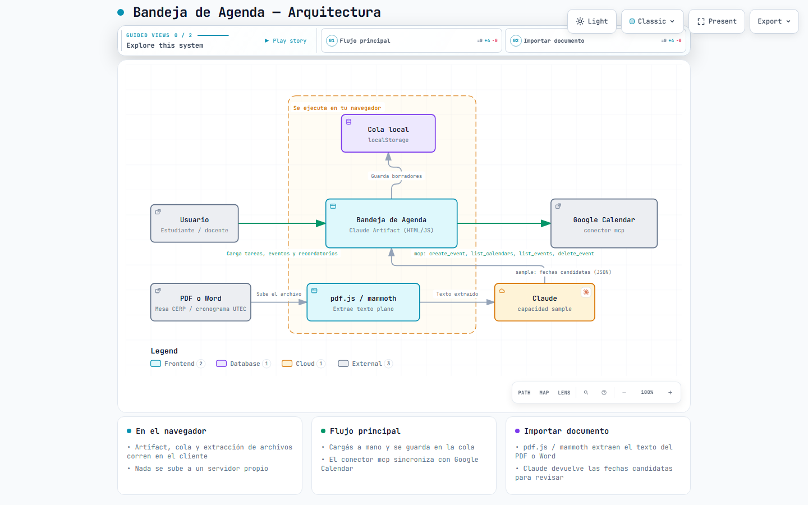

# Bandeja de Agenda

Cargá tareas, eventos y recordatorios a mano —o importalos desde un PDF/Word (mesas de examen del CERP, cronogramas de la UTEC, etc.)— revisalos en una cola, y enviálos a tu Google Calendar con un clic.

Es un [Claude Artifact](https://www.anthropic.com/news/artifacts): una sola página HTML autocontenida que corre dentro de Claude y usa dos capacidades del runtime de Claude para hacer el trabajo real:

- **`mcp`** — llama al conector de Google Calendar de la cuenta que tiene abierto el artifact, para crear/listar/borrar eventos.
- **`sample`** — le pide a Claude que lea el texto extraído de un PDF/DOCX y devuelva las fechas de participación en formato estructurado.

▶ **Probalo en vivo:** https://claude.ai/artifact/TNS1S58FWjoc4sQcD9LzLm

## ⚠️ Importante: esto no es una web app común

`index.html` **no funciona abriéndolo directo en el navegador** (doble clic, `file://`, GitHub Pages, un servidor propio, etc.). Depende de `window.claude`, un puente que solo existe cuando la página corre **dentro de un Claude Artifact** con permisos concedidos. Fuera de ese contexto, el conector de Calendar y la lectura de documentos se apagan solos (el resto de la interfaz se ve, pero sin conexión real).

Este repo existe para:
- Compartir y versionar el código fuente de la idea.
- Que cualquiera pueda leerlo, proponer cambios o adaptarlo.
- Servir de base para volver a publicarlo como Artifact (propio o de otra persona) copiando el contenido de `index.html`.

## Arquitectura



Versión interactiva (pan/zoom, capas, vistas guiadas): [`docs/architecture.html`](docs/architecture.html) — descargala y abrila en el navegador.

## Cómo funciona (por dentro)

```
┌─────────────────────────┐
│   index.html (Artifact) │
│                          │
│  Composer → Cola local   │  localStorage, por navegador
│      │                   │
│      ├─ mcp.callTool ────┼──► Google Calendar (create_event,
│      │                   │     list_calendars, list_events,
│      │                   │     delete_event)
│      │                   │
│  Importar PDF/Word        │
│      ├─ pdf.js / mammoth  │  extracción de texto, 100% en el navegador
│      └─ sample.json ─────┼──► Claude (extrae fechas → JSON)
└─────────────────────────┘
```

1. **Composer**: elegís tipo (Evento / Tarea / Recordatorio), completás título, fecha, horario, calendario destino, aviso previo y descripción. Se agrega a una **cola** local — todavía no toca tu calendario.
2. **Cola**: cada fila tiene un botón **Enviar**, que ahí sí llama a `create_event` sobre el calendario elegido. Si algo falla (permiso vencido, conector no conectado, etc.) se muestra el motivo y, cuando corresponde, un botón para reintentar.
3. **Importar documento**: subís un `.pdf` o `.docx`. El archivo se procesa en tu navegador (nunca se sube a ningún servidor) con `pdf.js` (PDF) o `mammoth.js` (Word) para sacar el texto plano. Ese texto se manda a Claude vía `sample.json` con una consigna en español pensada para mesas de examen / cronogramas académicos, que devuelve un array de fechas candidatas.
4. **Revisión de candidatos**: cada fecha extraída aparece en una fila editable (por si el documento tiene errores de OCR o falta algún dato). Desde ahí se agrega, una por una o todas juntas, a la cola del paso 1.
5. **Próximos en Calendar**: un panel de lectura muestra los próximos eventos reales del calendario principal, para tener contexto mientras cargás cosas nuevas.

Nada se persiste en un servidor propio: la cola vive en `localStorage` del navegador (por eso es "por dispositivo"), y lo único que sale de la página son las llamadas a Google Calendar y a Claude, ambas con el consentimiento de quien la usa.

## Manual de uso

### Agregar una entrada a mano

1. Elegí el tipo arriba del formulario:
   - **Evento** → bloquea un horario (por defecto 1 hora).
   - **Tarea** → bloque corto (30 min) con aviso 60 min antes por defecto.
   - **Recordatorio** → bloque muy corto (10 min) con aviso a la hora exacta.
2. Completá título, fecha y horario (se autocompletan con valores razonables, editables).
3. Elegí el calendario destino (se cargan los tuyos reales) y, si querés, un aviso previo distinto y una descripción.
4. **"Agregar a la cola"** — todavía no se sube a Google Calendar.
5. En la cola, apretá **Enviar** en la fila que quieras subir. Vas a ver el estado cambiar a "Sincronizado" con un link "ver en Calendar".
6. Si te arrepentís de una que ya subiste, **"Eliminar de Calendar"** la borra también del calendario real.

### Importar fechas desde un PDF o Word

1. En el panel de arriba, **"Elegir archivo"** y seleccioná un `.pdf` o `.docx` (convocatoria a mesa de examen, cronograma, circular, etc.).
2. **"Analizar documento"**. Primero se extrae el texto en tu navegador, después se le pide a Claude que identifique las fechas de participación (exámenes, tribunales, entregas).
3. Revisá los resultados: cada fila es editable (fecha, título, horario, descripción) por si el documento traía datos ambiguos o el OCR falló.
4. **"Agregar"** en una fila puntual, o **"Agregar todas a la cola"** para pasarlas todas de una.
5. Desde ahí seguís el flujo normal: revisás en la cola y apretás **Enviar** para subir cada una a Google Calendar.

**Limitaciones conocidas:**
- Los `.doc` viejos (formato binario, no `.docx`) no se pueden leer — convertilo a `.docx` o exportalo a PDF primero.
- Un PDF escaneado como imagen (sin texto seleccionable) no se puede leer: no hay OCR incorporado.
- Documentos muy largos se recortan a ~45.000 caracteres antes de analizarlos (se avisa en pantalla si pasó).
- La cola es local al navegador: si la abrís desde otro dispositivo no vas a ver lo que cargaste en este.

## Requisitos para usarlo

- Una cuenta de Claude con el conector **Google Calendar** conectado (Ajustes → Conectores).
- Acceso a Claude Artifacts con las capacidades `mcp` y `sample` habilitadas (están disponibles por defecto en claude.ai).

## Stack técnico

- HTML/CSS/JS vanilla, sin build ni dependencias de servidor.
- [pdf.js](https://cdnjs.com/libraries/pdf.js) para extraer texto de PDF, en el navegador.
- [mammoth.js](https://cdnjs.com/libraries/mammoth) para extraer texto de `.docx`, en el navegador.
- Runtime de Claude Artifacts (`window.claude.use("mcp" | "sample")`) para la integración con Google Calendar y la lectura asistida de documentos.

## Licencia

MIT — usalo, adaptalo, compartilo.
